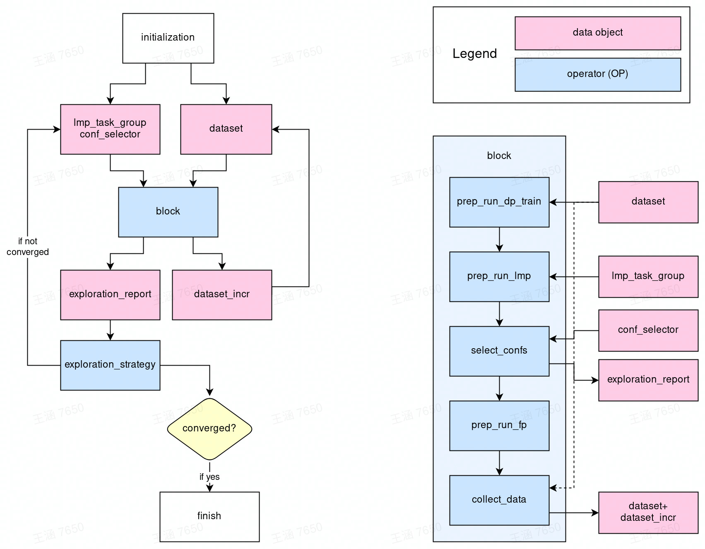
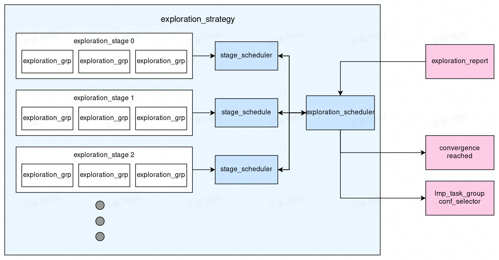

# Developers' guide

- [The concurrent learning algorithm](#the-concurrent-learning-algorithm)
- [Overview of the DPGEN2 implementation](#overview-of-the-dpgen2-implementation)
- [The DPGEN2 workflow](#the-dpgen2-workflow)
- [How to contribute](#how-to-contribute)

## The concurrent learning algorithm

DPGEN2 implements the concurrent learning algorithm named DP-GEN, described in [this paper](https://doi.org/10.1016/j.cpc.2020.107206). It is noted that other types of workflows, like active learning, should be easily implemented within the infrastructure of DPGEN2. 

The DP-GEN algorithm is iterative. In each iteration, four steps are consecutively executed: training, exploration, selection, and labeling. 

1. **Training**. A set of DP models are trained with the same dataset and the same hyperparameters. The only difference is the random seed initializing the model parameters. 
2. **Exploration**. One of the DP models is used to explore the configuration space. The strategy of exploration highly depends on the purpose of the application case of the model. The simulation technique for exploration can be molecular dynamics, Monte Carlo, structure search/optimization, enhanced sampling, or any combination of them. Current DPGEN2 only supports exploration based on molecular simulation platform [LAMMPS](https://www.lammps.org/).
3. **Selection**. Not all the explored configurations are labeled, rather, the model prediction errors on the configurations are estimated by the ***model deviation***, which is defined as the standard deviation in predictions of the set of the models. The critical configurations with large and not-that-large errors are selected for labeling. The configurations with very large errors are not selected because the large error is usually caused by non-physical configurations, e.g. overlapping atoms. 
4. **Labeling**. The selected configurations are labeled with energy, forces, and virial calculated by a method of first-principles accuracy. The usually used method is the [density functional theory](https://doi.org/10.1103/PhysRev.140.A1133) implemented in [VASP](https://www.vasp.at/), [Quantum Expresso](https://www.quantum-espresso.org/), [CP2K](https://www.cp2k.org/), and etc.. The labeled data are finally added to the training dataset to start the next iteration. 

In each iteration, the quality of the model is improved by selecting and labeling more critical data and adding them to the training dataset. The DP-GEN iteration is converged when no more critical data can be selected.

## Overview of the DPGEN2 Implementation 

The implementation DPGEN2 is based on the workflow platform [dflow](https://github.com/dptech-corp/dflow), which is a python wrapper of the [Argo Workflows](https://argoproj.github.io/workflows/), an open-source container-native workflow engine on [Kubernetes](https://kubernetes.io/).

The DP-GEN algorithm is conceptually modeled as a computational graph. The implementation is then considered as two lines: the operators and the workflow.
1. **Operators**. Operators are implemented in Python v3. The operators should be implemented and tested ***without*** the workflow. 
2. **Workflow**. Workflow is implemented on [dflow](https://github.com/dptech-corp/dflow). Ideally, the workflow is implemented and tested with all operators mocked. 

## The DPGEN2 workflow

The workflow of DPGEN2 is illustrated in the following figure

In the center is the `block` operator, which is a super-OP (an OP composed by several OPs) for one DP-GEN iteration, i.e. the super-OP of the training, exploration, selection, and labeling steps. The inputs of the `block` OP are `lmp_task_group`, `conf_selector` and `dataset`. 
- `lmp_task_group`: definition of a group of LAMMPS tasks that explore the configuration space. 
- `conf_selector`: defines the rule by which the configurations are selected for labeling.
- `dataset`: the training dataset.

The outputs of the `block` OP are
- `exploration_report`: a report recording the result of the exploration. For example, home many configurations are accurate enough and how many are selected as candidates for labeling. 
- `dataset_incr`: the increment of the training dataset.

The `dataset_incr` is added to the training `dataset`. 

The `exploration_report` is passed to the `exploration_strategy` OP. The `exploration_strategy` implements the strategy of exploration. It reads the `exploration_report` generated by each iteration (`block`), then tells if the iteration is converged. If not, it generates a group of LAMMPS tasks (`lmp_task_group`) and the criteria of selecting configurations (`conf_selector`). The `lmp_task_group` and `conf_selector` are then used by `block` of the next iteration. The iteration closes.

### Inside the `block` operator

The inside of the super-OP `block` is displayed on the right-hand side of the figure. It contains the following steps to finish one DPGEN iteration
- `prep_run_dp_train`: prepares training tasks of DP models and runs them.
- `prep_run_lmp`: prepares the LAMMPS exploration tasks and runs them.
- `select_confs`: selects configurations for labeling from the explored configurations.
- `prep_run_fp`: prepares and runs first-principles tasks.
- `collect_data`: collects the `dataset_incr` and adds it to the `dataset`.

### The exploration strategy

The exploration strategy defines how the configuration space is explored by the concurrent learning algorithm.  The design of the exploration strategy is graphically illustrated in the following figure. The exploration is composed of stages. Only the DP-GEN exploration is converged at one stage (no configuration with a large error is explored), the exploration goes to the next iteration. The whole procedure is controlled by `exploration_scheduler`. Each stage has its schedule, which talks to the `exploration_scheduler` to generate the schedule for the DP-GEN algorithm. 

Some concepts are explained below:

- **Exploration group**. A group of LAMMPS tasks shares similar settings. For example, a group of NPT MD simulations in a certain thermodynamic space.
- **Exploration stage**. The `exploration_stage` contains a list of exploration groups. It contains all information needed to define the `lmp_task_group` used by the `block` in the DP-GEN iteration.  
- **Stage scheduler**. It guarantees the convergence of the DP-GEN algorithm in each `exploration_stage`. If the exploration is not converged, the `stage_scheduler`  generates `lmp_task_group` and `conf_selector` from the `exploration_stage` for the next iteration (probably with a different initial condition, i.e. different initial configurations and randomly generated initial velocity).
- **Exploration scheduler**. The scheduler for the DP-GEN algorithm. When DP-GEN is converged in one of the stages, it goes to the next stage until all planned stages are used.

## How to contribute

Anyone interested in the DPGEN2 project may contribute OPs, workflows, and exploration strategies.

- To contribute OPs, one may check the [guide on writing operators](./operator.md)

- To contribute workflows, one may take the DP-GEN workflow as an example. It is implemented in [dpgen2/flow/dpgen_loop.py](https://github.com/wanghan-iapcm/dpgen2/blob/master/dpgen2/flow/dpgen_loop.py) and tested with all operators mocked in [test/test_dpgen_loop.py](https://github.com/wanghan-iapcm/dpgen2/blob/master/tests/test_dpgen_loop.py)

- To contribute the exploration strategy, one may check the [guide on writing exploration strategies](./exploration.md)
